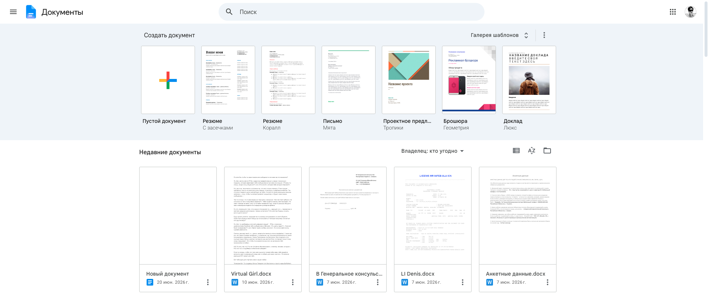
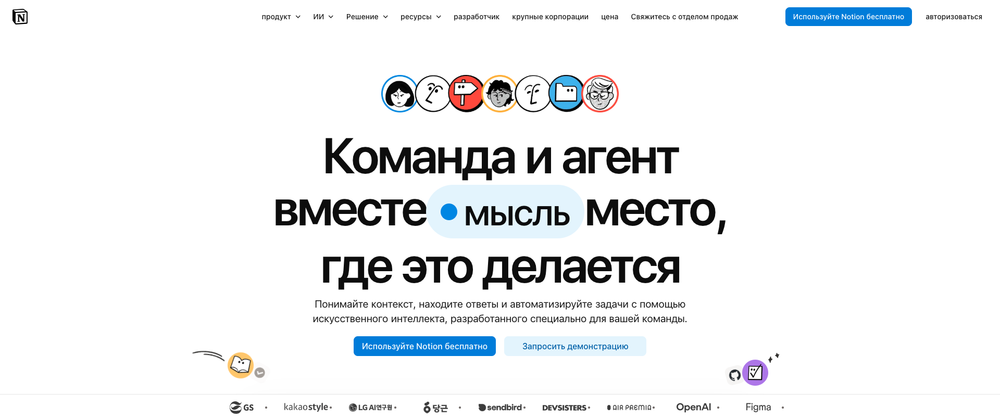
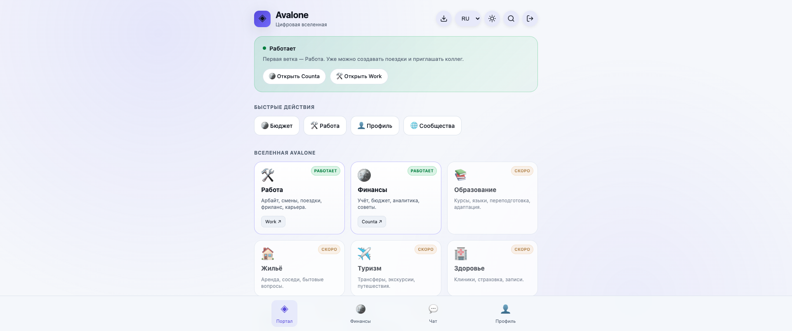
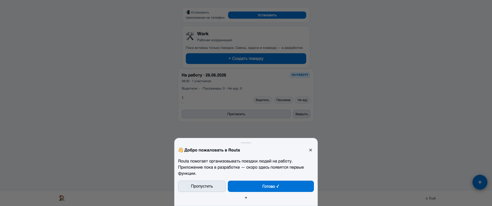
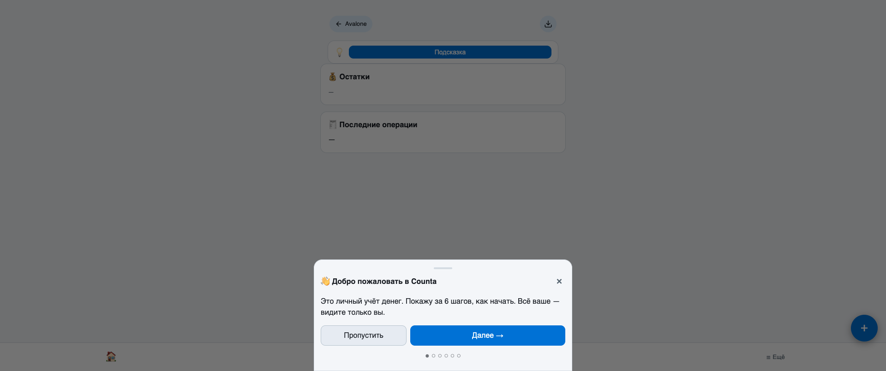

# ТЗ: Work v2 + единый Avalone shell

> Цель: довести приложение Work до production-ready состояния и устранить ощущение «отрыва» от платформы Avalone. Все приложения (Counta, Work, будущие ветки) должны восприниматься пользователем как единая платформа с общей навигацией, авторизацией и визуальным языком.

---

## 1. Продуктовая постановка

### 1.1. Что такое Work
Work — это ветка Avalone для рабочей координации. Первая функция: организация поездок людей на работу и с работы. Все участники равноправны: любой может отметить себя и любого другого участника поездки ролью «Водитель / Пассажир / Не еду».

### 1.2. Что в MVP v2
- Полноценный UI поездок (создание, редактирование, удаление, фильтры).
- Приглашения по ссылке и QR-коду.
- Уведомления (email + in-app) о приглашениях, изменениях, напоминаниях.
- Графики и статистика по поездкам.
- Единый Avalone shell (верхняя панель + навигация), который виден и в Work, и в Counta, и на портале.
- Причёсывание портала Avalone: убрать косяки, сделать единую навигацию, единый визуальный язык.

### 1.3. Что НЕ делаем в v2
- Чат внутри поездок.
- Интеграция карт и маршрутов.
- Платежи за бензин.
- Мобильные push-уведомления (ограничиваемся email + in-app).
- Смены, задачи, команда — откладываем до v3, но UI должен их предвосхищать.

---

## 2. Исследование: как делают взрослые продукты

Проблема: когда пользователь переходит из портала Avalone в Counta или Work, он чувствует, что «вышел» из платформы. Единственная связь — кнопка «Назад в Avalone».

Взрослые платформы решают это через **shared shell** — общую оболочку вокруг всех приложений. Примеры:

### 2.1. Google Workspace
- Вверху всегда виден топ-бар: логотип приложения, поиск, app launcher (9 точек), профиль.
- App launcher позволяет переключаться между Docs, Sheets, Drive и т.д. без ощущения выхода.
- Визуальный язык единый: цвета, шрифты, кнопки.

### 2.2. Notion
- Слева — sidebar с workspace, разделами, страницами.
- Верхний топ-бар минималистичный, но показывает контекст.
- Всё внутри одного домена, переходы между страницами мгновенные.

### 2.3. Linear
- Слева — sidebar с командами, проектами, issues.
- Верхний топ-бар показывает workspace, поиск, профиль.
- Каждое приложение внутри одной оболочки.

### 2.4. Референсы в картинках

Google Docs — пример global top bar с app launcher, поиском и профилем:



Notion — пример единого визуального языка и логотипа в топ-баре:



### 2.5. Текущее состояние Avalone

Портал Avalone (hero banner уже показывает Work как запущенную ветку):



Текущее приложение Work (MVP поездок):



Текущее приложение Counta (отдельное, без общего shell):



### 2.6. Выводы для Avalone

Нужно внедрить **Avalone shell** — общую для всех приложений панель:

1. **Global top bar** (всегда наверху):
   - Логотип Avalone + слоган.
   - Переключатель веток / приложений (Work, Counta, и т.д.).
   - Глобальный поиск.
   - Уведомления.
   - Профиль / выход.
   - Тема / язык.

2. **Contextual sidebar or bottom nav** (внутри приложения):
   - Work: Поездки, Статистика, Уведомления, Настройки.
   - Counta: Счета, Операции, Аналитика, Настройки.

3. **Breadcrumbs**:
   - Avalone → Work → Поездка «На работу 26 июня».

4. **Consistent visual language**:
   - Одинаковые цвета, типографика, скругления, кнопки, иконки.
   - Тёмная / светлая тема работает одинаково во всех приложениях.

5. **Unified auth**:
   - Вход один раз на Avalone. Все приложения знают пользователя.
   - Выход из любого приложения выходит из платформы.

6. **Cross-app links**:
   - Из Work можно перейти в Counta одним кликом.
   - Из Counta — в Work.
   - Переходы не открывают новую вкладку (если это не нужно), а меняют контент внутри платформы.

---

## 3. Avalone shell — техническое описание

### 3.1. Структура страницы любого приложения

```
┌─────────────────────────────────────────────────────────────┐
│  ◈ Avalone    [Work ▼]  [🔍 Поиск]  [🔔]  [🌙]  [RU ▼]  [👤] │  ← Global top bar
├──────────┬──────────────────────────────────────────────────┤
│          │  [Avalone] / [Work] / Поездки                   │  ← Breadcrumbs
│  [🛠️]    │                                                  │
│  Поездки │  ┌──────────────────────────────────────────┐   │
│          │  │  Создать поездку                         │   │
│  [📊]    │  └──────────────────────────────────────────┘   │
│  Статис. │                                                  │
│          │  ┌─ Поездка 26 июня, 08:30 ─┐                   │
│  [🔔]    │  │ На работу · 3 участника   │                   │
│  Уведом. │  └───────────────────────────┘                   │
│          │                                                  │
│  [⚙️]    │                                                  │
│  Настр.  │                                                  │
│          │                                                  │
└──────────┴──────────────────────────────────────────────────┘
```

### 3.2. Global top bar

Компоненты:

1. **Avalone logo** (`◈ Avalone`) — клик ведёт на портал `avalone.online`.
2. **Branch switcher** (`Work ▼`) — выпадающее меню со списком активных веток:
   - Work
   - Counta (Финансы)
   - ...другие активные ветки
   - Неактивные ветки показываются серым с меткой «Скоро».
3. **Global search** — поиск по объектам платформы (поездки, счета, операции, пользователи).
4. **Notifications bell** — индикатор непрочитанных уведомлений, выпадающий список последних.
5. **Theme toggle** — переключатель тёмной/светлой темы.
6. **Language switcher** — RU / EN / KO.
7. **Profile menu** — имя пользователя, email, выход.

### 3.3. App sidebar (десктоп)

Для Work:
- Поездки
- Статистика
- Уведомления
- Настройки

Для Counta (обновить):
- Счета
- Операции
- Аналитика
- Настройки

### 3.4. Bottom nav (мобильные)

Аналог sidebar, но внизу экрана. 4–5 пунктов.

### 3.5. Breadcrumbs

Всегда показывают путь:
`Avalone > Work > Поездки > На работу 26 июня`

Каждый элемент кликабелен.

### 3.6. Реализация

- Shell рендерится на стороне каждого приложения, но из **shared шаблона / компонента**.
- Вариант A: общий npm-пакет или Python package с Jinja-макросом.
- Вариант B: копирование `shell.html` в каждое приложение с единым источником в `avalone.online/design-system/`.
- Рекомендуется Вариант B для текущего стека: вынести `avalone-shell.html`, `avalone-shell.css`, `avalone-shell.js` в отдельный репозиторий или директорию и подключать в Counta/Work/Routa как git submodule или просто копировать при сборке.
- Все приложения используют один CSS-файл дизайн-системы.

---

## 4. Work — детальные экраны

### 4.1. Экран «Список поездок»

URL: `/`

Элементы:
- Заголовок «Поездки» + кнопка «+ Создать поездку».
- Фильтры: «Все / Предстоящие / Прошедшие / Я участвую / Я организатор».
- Поиск по дате/направлению.
- Карточки поездок:
  - Направление (иконка + текст).
  - Дата и время.
  - Количество участников.
  - Статус (Открыта / Закрыта / Отменена).
  - Кто водитель (аватар + имя).
  - Кнопки: «Пригласить», «Открыть».
- Пустое состояние: иллюстрация + текст «Пока нет поездок. Создайте первую».

### 4.2. Экран «Создание поездки»

URL: `/trips/new` или модальное окно

Поля:
- Направление: radio «На работу» / «С работы».
- Дата: date picker.
- Время: time picker.
- Комментарий (опционально): textarea.
- Кнопка «Создать».

Валидация:
- Дата не может быть в прошлом.
- Время обязательно.
- Комментарий до 500 символов.

### 4.3. Экран «Детали поездки»

URL: `/trips/<id>`

Элементы:
- Breadcrumbs.
- Заголовок: «На работу · 26 июня · 08:30».
- Статус + кнопки действий (редактировать, закрыть, удалить — только организатору).
- Блок «Участники»:
  - Список участников с аватарами.
  - Для каждого: имя, роль, места (если водитель).
  - Кнопки смены роли: «Водитель», «Пассажир», «Не еду».
  - Кнопка «Отметить за другого» (если участник не может зайти).
- Блок «Приглашение»:
  - Ссылка с кнопкой «Копировать».
  - QR-код для быстрого приглашения.
- Блок комментария.
- История изменений (кто и когда поменял роль) — опционально, но желательно.

### 4.4. Экран «Статистика»

URL: `/stats`

Элементы:
- Период: «Неделя / Месяц / Год / Всё время».
- Карточки:
  - Всего поездок.
  - Всего водителей / пассажиров.
  - Среднее количество участников на поездку.
- График: количество поездок по дням/неделям.
- Таблица: кто сколько раз был водителем / пассажиром.
- Кнопка «Экспорт CSV».

### 4.5. Экран «Уведомления»

URL: `/notifications`

- Список уведомлений: приглашение, изменение роли, напоминание.
- Индикатор прочитано/непрочитано.
- Кнопка «Отметить все прочитанными».

### 4.6. Экран «Настройки»

URL: `/settings`

- Профиль (только отображение, редактирование в Avalone).
- Настройки уведомлений: email о приглашениях, изменениях, напоминаниях.
- Язык и тема (можно дублировать из top bar).

### 4.7. Экран приглашения

URL: `/join/<code>`

- Если пользователь не вошёл: редирект на Avalone login, после входа — автоматическое присоединение.
- Если вошёл: показать карточку поездки и кнопку «Присоединиться».
- После присоединения — редирект на детали поездки.

---

## 5. Counta — обновления для единства

### 5.1. Заменить верхнюю панель Counta на Avalone shell
- Убрать отдельную кнопку «Назад в Avalone».
- Вместо неё — global top bar с branch switcher, где Counta — текущая ветка.
- Сохранить bottom nav Counta, но привести стиль к дизайн-системе Avalone.

### 5.2. Breadcrumbs
- Avalone → Counta → Счета / Операции / Аналитика.

### 5.3. Единый профиль
- Профиль редактируется в Avalone, в Counta только отображается.

### 5.4. Переходы между приложениями
- Из Counta можно перейти в Work через branch switcher.
- Не открывать новую вкладку (кроме явных внешних ссылок).

---

## 6. Avalone portal — обновления

### 6.1. Убрать косяки
- Проверить все отступы, выравнивание, размеры шрифтов.
- Убедиться, что все кнопки кликабельны и ведут куда нужно.
- Убрать дублирующиеся элементы (например, статусная карточка + карточка ветки с похожей информацией).
- Проверить пустые состояния и ошибки.

### 6.2. Единый shell
- Портал сам использует тот же top bar, что и приложения.
- На портале branch switcher показывает все ветки.

### 6.3. Профиль
- Добавить страницу профиля `/profile`:
  - Имя / логин / email.
  - Смена пароля.
  - Настройки уведомлений платформы.
  - Язык и тема.

### 6.4. Глобальный поиск
- Поиск по объектам всех приложений (пока хотя бы по названиям поездок и счетам).

### 6.5. Notifications center
- Верхний bell показывает уведомления из всех приложений.

---

## 7. Технические требования

### 7.1. Стек
- Backend: Python FastAPI + Jinja2 (как сейчас).
- Frontend: vanilla JS + CSS (PWA), без новых фреймворков.
- База данных: SQLite с миграциями.
- Auth: Avalone SSO через shared signed cookie.

### 7.2. Дизайн-система
- Все цвета, шрифты, отступы — в CSS-переменных.
- Один файл `avalone-variables.css` для всех приложений.
- Компоненты: кнопки, карточки, модалки, формы, таблицы — в `avalone-components.css`.
- Иконки — SVG, единый набор.
- Тёмная/светлая тема — через `data-theme` и `prefers-color-scheme`.

### 7.3. CSS-переменные (обязательно единые)

```css
:root {
  --bg: #0a0c10;
  --bg-2: #11141b;
  --card: #151922;
  --card-2: #1c212c;
  --line: #2a3040;
  --line-2: #3a4156;
  --txt: #f0f2f6;
  --muted: #8b94a7;
  --accent: #7c5cff;
  --accent-2: #a78bfa;
  --green: #3fb950;
  --red: #f85149;
  --shadow: 0 8px 32px rgba(0,0,0,.35);
}
```

### 7.4. Компоненты

#### Кнопки
- `.btn-primary` — основное действие.
- `.btn-secondary` — вторичное действие.
- `.btn-ghost` — третичное.
- `.btn-danger` — опасное действие.
- Все кнопки имеют hover, active, disabled состояния.
- Минимальная высота 40px, padding 12px 16px, border-radius 12px.

#### Карточки
- background: var(--card)
- border: 1px solid var(--line)
- border-radius: 16px
- padding: 16px
- shadow: var(--shadow)

#### Формы
- label: font-size 13px, color var(--muted), margin-bottom 6px.
- input: height 44px, border-radius 12px, border 1px solid var(--line), background var(--bg-2), color var(--txt).
- input:focus: border-color var(--accent).
- Ошибки: красный фон с красным текстом, border-radius 10px.

#### Модалки
- overlay: rgba(0,0,0,0.6)
- sheet: border-radius 20px 20px 0 0 (мобильные), 16px (десктоп)
- header с заголовком и кнопкой закрытия
- footer с primary action

### 7.5. Мобильная адаптация
- Desktop (>1024px): sidebar слева, контент справа.
- Tablet (768–1024px): sidebar может быть collapsible.
- Mobile (<768px): bottom nav, контент на всю ширину, модалки снизу.

### 7.6. PWA
- Manifest для Work обновлён: name «Work — Avalone», иконки, theme-color.
- Service worker кэширует shell и основные ресурсы.
- Установка на домашний экран работает.

### 7.7. API

#### Trips
- `GET /api/trips` — список (с фильтрами).
- `POST /api/trips` — создание.
- `GET /api/trips/{id}` — детали.
- `PUT /api/trips/{id}` — редактирование (организатор).
- `DELETE /api/trips/{id}` — удаление (организатор).
- `POST /api/trips/{id}/close` — закрыть (организатор).
- `POST /api/trips/{id}/join` — присоединиться.
- `POST /api/trips/{id}/members/{tid}` — изменить роль участника.

#### Notifications
- `GET /api/notifications` — список.
- `POST /api/notifications/{id}/read` — отметить прочитанным.
- `POST /api/notifications/read-all` — отметить все.
- `GET /api/notifications/unread-count` — счётчик для bell.

#### Stats
- `GET /api/stats` — общая статистика.
- `GET /api/stats/export.csv` — экспорт.

### 7.8. База данных

Таблицы:
- `users` (создаётся через SSO mapping).
- `trips` — id, tenant_id, direction, date, time, comment, status, invite_code, created_at.
- `trip_members` — trip_id, tenant_id, role, seats, updated_at.
- `notifications` — id, tenant_id, type, title, body, data, read, created_at.
- `notification_settings` — tenant_id, email_invite, email_role_change, email_reminder, in_app.

Миграции: каждое изменение схемы — отдельный SQL-файл, версионирование через `schema_version`.

### 7.9. Email-уведомления
- Шаблоны в Jinja2.
- Отправка через фоновую задачу (background task или cron).
- Пока можно использовать локальный SMTP или почтовый API (SendGrid/Resend) по желанию.
- Важно: не блокировать HTTP-ответ отправкой письма.

### 7.10. Безопасность
- Все API требуют авторизации через Avalone cookie.
- Проверка прав: только участник поездки видит её.
- CSRF: для state-changing POST запросов использовать SameSite=None cookie + origin check.
- XSS: все пользовательские данные экранируются в шаблонах.
- SQL injection: только параметризованные запросы.

---

## 8. User flows

### 8.1. Создание поездки
1. Пользователь нажимает «+ Создать поездку».
2. Заполняет форму.
3. Нажимает «Создать».
4. Система создаёт поездку, добавляет организатора как участника.
5. Редирект на детали поездки.
6. Система показывает уведомление «Поездка создана».

### 8.2. Приглашение
1. На деталях поездки нажимает «Пригласить».
2. Показывается модалка со ссылкой и QR-кодом.
3. Пользователь копирует ссылку или делится QR.
4. Система отправляет email-приглашение (если email у Avalone user).

### 8.3. Присоединение по ссылке
1. Новый пользователь открывает `/join/<code>`.
2. Если не вошёл — редирект на Avalone login.
3. После входа система проверяет код и добавляет пользователя в поездку.
4. Редирект на детали поездки.
5. Уведомление «Вы присоединились к поездке».

### 8.4. Изменение роли
1. Участник открывает детали поездки.
2. Нажимает кнопку роли для себя или другого участника.
3. Система обновляет роль.
4. Отправляются уведомления всем участникам об изменении.

### 8.5. Переход между приложениями
1. Пользователь в Work.
2. Нажимает branch switcher в top bar.
3. Выбирает Counta.
4. Браузер переходит на `counta.avalone.online`.
5. Пользователь остаётся авторизованным (shared cookie).
6. Top bar остаётся тем же — пользователь чувствует, что это всё Avalone.

---

## 9. Definition of Done

Задача считается выполненной, когда:

- [ ] Avalone shell реализован и подключён к порталу, Work, Counta.
- [ ] Все приложения используют единую дизайн-систему (CSS-переменные, компоненты, иконки).
- [ ] Work имеет все экраны из раздела 4.
- [ ] Функционал поездок работает полностью: создание, редактирование, удаление, приглашение, роли, фильтры.
- [ ] Графики и статистика отображаются на экране «Статистика».
- [ ] Уведомления работают (in-app + email).
- [ ] Профиль пользователя доступен и редактируется в Avalone.
- [ ] Все тексты вынесены в глоссарий ru/en/ko.
- [ ] Мобильная адаптация проверена на 320px, 375px, 768px, 1440px.
- [ ] PWA manifest и service worker обновлены.
- [ ] Написаны unit/integration тесты, все проходят.
- [ ] Написан README с запуском.
- [ ] Проведено end-to-end тестирование всех user flows.
- [ ] Разработчик предоставил self-audit report.
- [ ] Проведён ручной UI/UX review (скриншоты + видео).

---

## 10. Чек-листы для разработчика (self-audit)

### 10.1. UX/UI
- [ ] Нет сломанных layout на любом разрешении.
- [ ] Все интерактивные элементы имеют hover/active/focus состояния.
- [ ] Пустые состояния понятны и не выглядят как ошибки.
- [ ] Ошибки сети/сервера показываются пользователю.
- [ ] Все формы валидируются до отправки.
- [ ] Нет дублирующихся или конфликтующих элементов навигации.
- [ ] Переход между приложениями не вызывает ощущения выхода из платформы.
- [ ] Темная и светлая тема переключаются без артефактов.
- [ ] Шрифты читаемы, контраст соответствует WCAG AA.
- [ ] Все SVG-иконки имеют единый стиль (толщина линии, размер).

### 10.2. Код
- [ ] Нет dead code, console.log, закомментированных кусков.
- [ ] Нет секретов в коде.
- [ ] Все SQL-запросы параметризованы.
- [ ] Все API роуты возвращают корректные HTTP-статусы.
- [ ] Исключения обработаны, нет необработанных 500.
- [ ] CSS использует переменные дизайн-системы.
- [ ] JS не использует глобальные переменные без необходимости.
- [ ] Функции не длиннее 50 строк (по возможности).
- [ ] Код покрыт тестами критичные пути.
- [ ] README актуален.

### 10.3. Performance
- [ ] Время загрузки первого экрана < 2 секунд на 3G.
- [ ] Нет N+1 запросов к БД.
- [ ] Статика кэшируется.
- [ ] Service worker работает корректно.

### 10.4. Accessibility
- [ ] Все кнопки и ссылки имеют понятный текст или aria-label.
- [ ] Формы связаны с label.
- [ ] Модалки захватывают фокус.
- [ ] Цвет не является единственным способом передачи информации.

---

## 11. Процесс проверки заказчиком

### 11.1. Подготовка
- Разработчик разворачивает staging-версию.
- Прикладывает ссылку, логин/пароль тестового пользователя.
- Прикладывает self-audit report и скриншоты.

### 11.2. Проверка платформенной целостности
- [ ] Открыть портал Avalone.
- [ ] Перейти в Work через branch switcher.
- [ ] Убедиться, что top bar остался тем же.
- [ ] Перейти в Counta через branch switcher.
- [ ] Убедиться, что авторизация сохранилась.
- [ ] Вернуться в портал через логотип.

### 11.3. Проверка Work
- [ ] Создать поездку.
- [ ] Скопировать пригласительную ссылку.
- [ ] В другом браузере зарегистрироваться и перейти по ссылке.
- [ ] Присоединиться к поездке.
- [ ] Сменить роль.
- [ ] Организатор меняет роль другому участнику.
- [ ] Посмотреть статистику.
- [ ] Проверить уведомления.

### 11.4. Проверка портала
- [ ] Все ветки отображаются корректно.
- [ ] Нет визуальных косяков.
- [ ] Профиль открывается и редактируется.
- [ ] Поиск работает.

---

## 12. Артефакты, которые должен предоставить разработчик

1. Pull request с описанием.
2. Ссылка на staging.
3. Self-audit report (чек-листы из раздела 10).
4. Скриншоты всех экранов Work на desktop и mobile.
5. Видео основных user flows (2–3 минуты).
6. Результаты тестов.
7. Обновлённый README.

---

## 13. Рекомендации по организации работы

### 13.1. Фазы
1. **Фаза 1 — Avalone shell + дизайн-система** (1 неделя)
   - Создать shared shell компонент.
   - Обновить CSS-переменные и компоненты.
   - Подключить shell к порталу.

2. **Фаза 2 — Work UI/UX** (1–1.5 недели)
   - Все экраны Work.
   - Мобильная адаптация.
   - PWA.

3. **Фаза 3 — Функционал** (1 неделя)
   - Приглашения, роли, фильтры.
   - Уведомления.
   - Графики.

4. **Фаза 4 — Counta + портал** (3–5 дней)
   - Подключить shell к Counta.
   - Причесать портал.
   - Профиль, поиск, уведомления.

5. **Фаза 5 — Тестирование и polish** (3–5 дней)
   - Тесты, bugfix, скриншоты, видео.

### 13.2. Регулярные демо
- Каждые 2–3 дня разработчик показывает текущий прогресс скриншотами/видео.
- Это позволяет ловить отхождение от ожиданий на раннем этапе.

### 13.3. Запретные практики
- Не использовать разные цвета/шрифты в разных приложениях.
- Не открывать приложения в новых вкладках без явной причины.
- Не хранить секреты в коде.
- Не оставлять неработающие кнопки или placeholder-экраны.
- Не игнорировать мобильную версию.

---

## 14. Примечания

- Все макеты — текстовые wireframes. Разработчик должен превратить их в pixel-perfect UI на основе дизайн-системы.
- Если разработчик хочет отступить от ТЗ — обсуждается отдельно.
- «Причесать» означает: убрать лишнее, выровнять, сделать консистентным, проверить каждый пиксель.
- Всё, что не описано в ТЗ, но очевидно для production (например, обработка ошибок, loading states), должно быть сделано без напоминаний.
